# Todo CLI - Architecture Documentation

## Table of Contents

1. [Overview](#overview)
2. [High-Level Architecture](#high-level-architecture)
3. [Component Design](#component-design)
4. [Data Flow](#data-flow)
5. [Storage Architecture](#storage-architecture)
6. [Package Organization](#package-organization)
7. [Design Patterns](#design-patterns)
8. [Technology Stack](#technology-stack)

---

## Overview

Todo CLI is built following **Clean Architecture** principles with clear separation of concerns, dependency inversion, and modular design. The application is structured into distinct layers that promote maintainability, testability, and scalability.

### Key Architectural Principles

- **Separation of Concerns**: Each package has a single, well-defined responsibility
- **Dependency Inversion**: High-level modules don't depend on low-level modules
- **Interface-Based Design**: Abstractions over concrete implementations
- **Single Responsibility**: Each component does one thing well
- **DRY (Don't Repeat Yourself)**: Shared functionality is extracted into reusable packages

---

## High-Level Architecture

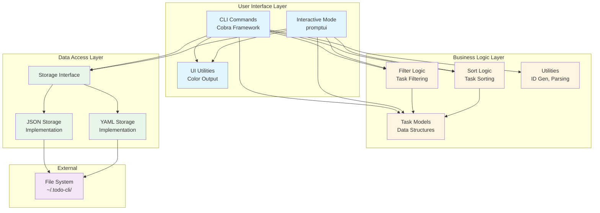

---

## Component Design

### 1. Command Layer (`cmd/`)

The command layer implements CLI commands using the Cobra framework. Each command is self-contained and orchestrates the necessary components to fulfill its responsibility.

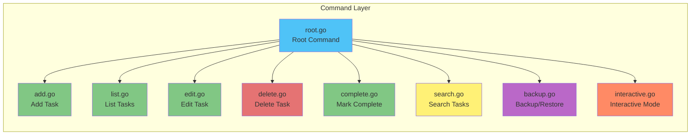

**Responsibilities:**

- Parse command-line arguments and flags
- Validate user input
- Orchestrate business logic components
- Handle errors and display results
- Manage user interaction flow

### 2. Model Layer (`internal/models/`)

Core data structures and business logic for tasks.

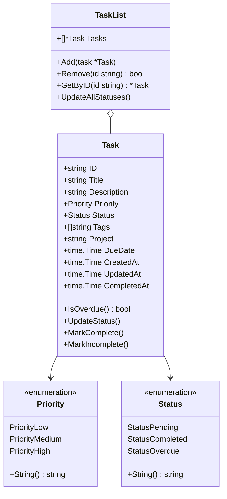

**Responsibilities:**

- Define task data structure
- Implement task-related business rules
- Handle task state transitions
- Provide task collection management

### 3. Storage Layer (`internal/storage/`)

Abstraction for data persistence with multiple implementations.

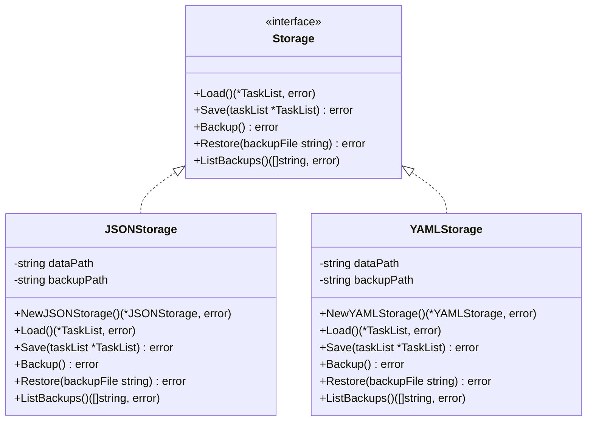

**Responsibilities:**

- Abstract persistence implementation details
- Provide multiple storage backends (JSON, YAML)
- Handle file I/O operations
- Manage backups and restoration
- Ensure data integrity

**Design Benefits:**

- Easy to add new storage backends (e.g., SQLite, PostgreSQL)
- Testable through interface mocking
- Swappable implementations at runtime

### 4. Filter Package (`pkg/filter/`)

Reusable filtering logic for task collections.

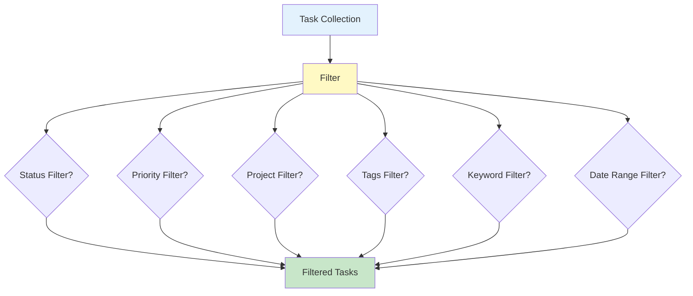

**Filter Structure:**

```go
type Filter struct {
    Status   *models.Status
    Priority *models.Priority
    Project  string
    Tags     []string
    Keyword  string
    DateFrom time.Time
    DateTo   time.Time
}
```

**Responsibilities:**

- Apply multiple filter criteria
- Support combinatorial filtering
- Provide factory methods for common filters
- Efficient in-memory filtering

### 5. Sort Package (`pkg/sort/`)

Task sorting algorithms.

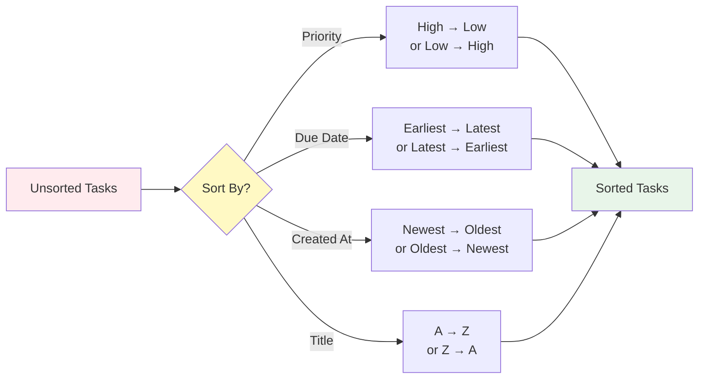

**Responsibilities:**

- Multiple sorting criteria
- Ascending/descending order support
- Efficient in-place sorting
- Handle edge cases (nil dates, empty fields)

### 6. UI Layer (`internal/ui/`)

User interface utilities for display and interaction.

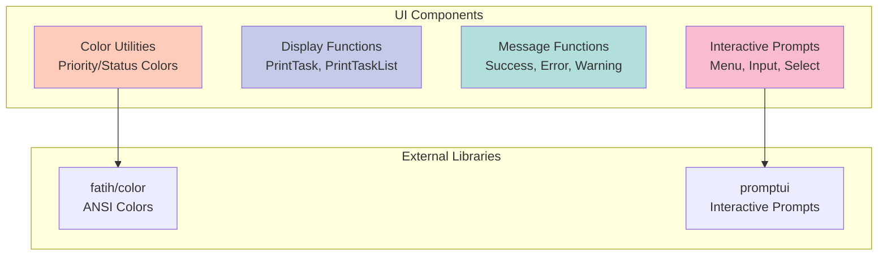

**Responsibilities:**

- Color-coded output
- Formatted task display
- Interactive menus and prompts
- User feedback messages
- Error presentation

---

## Data Flow

### Add Task Flow

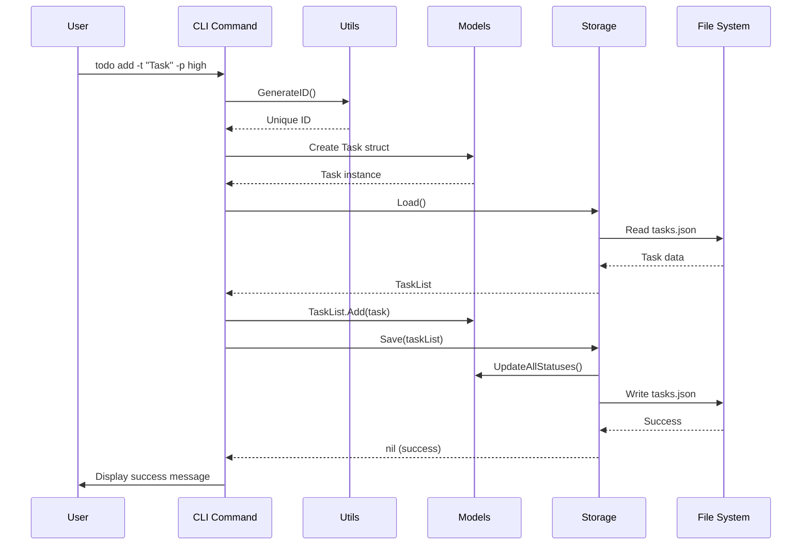

### List Tasks Flow

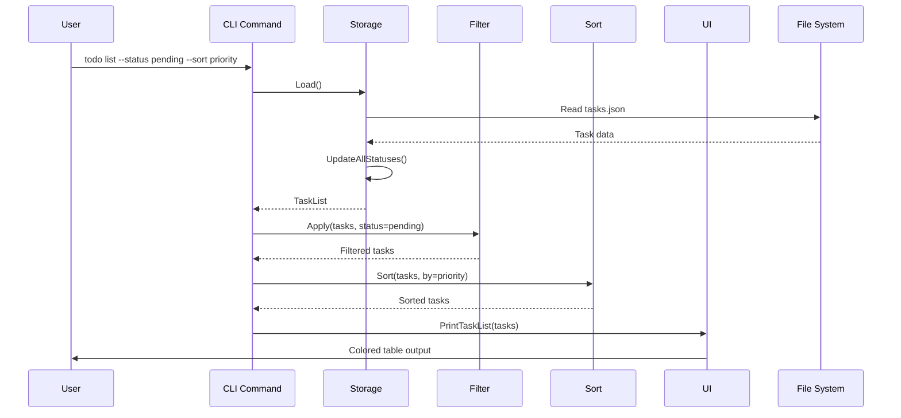

### Interactive Mode Flow

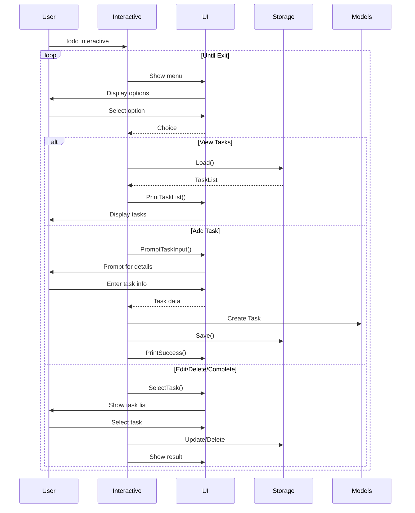

---

## Storage Architecture

### File System Structure

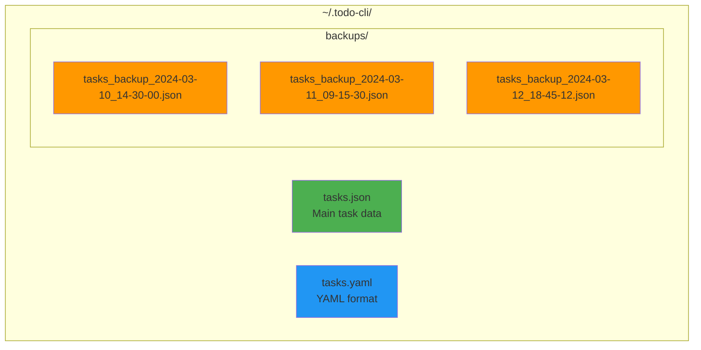

### Storage Implementation Strategy

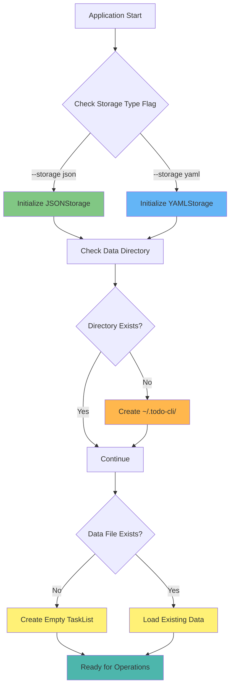

### Backup Strategy

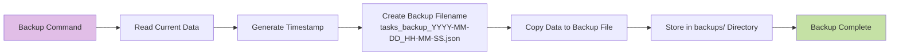

---

## Package Organization

### Directory Structure Philosophy

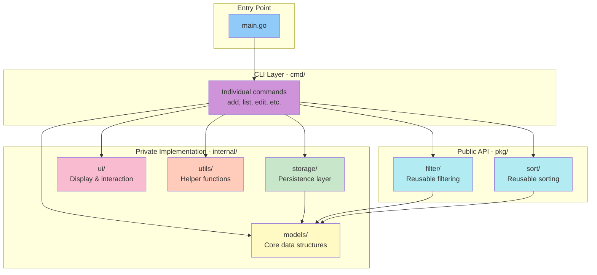

### Package Dependencies

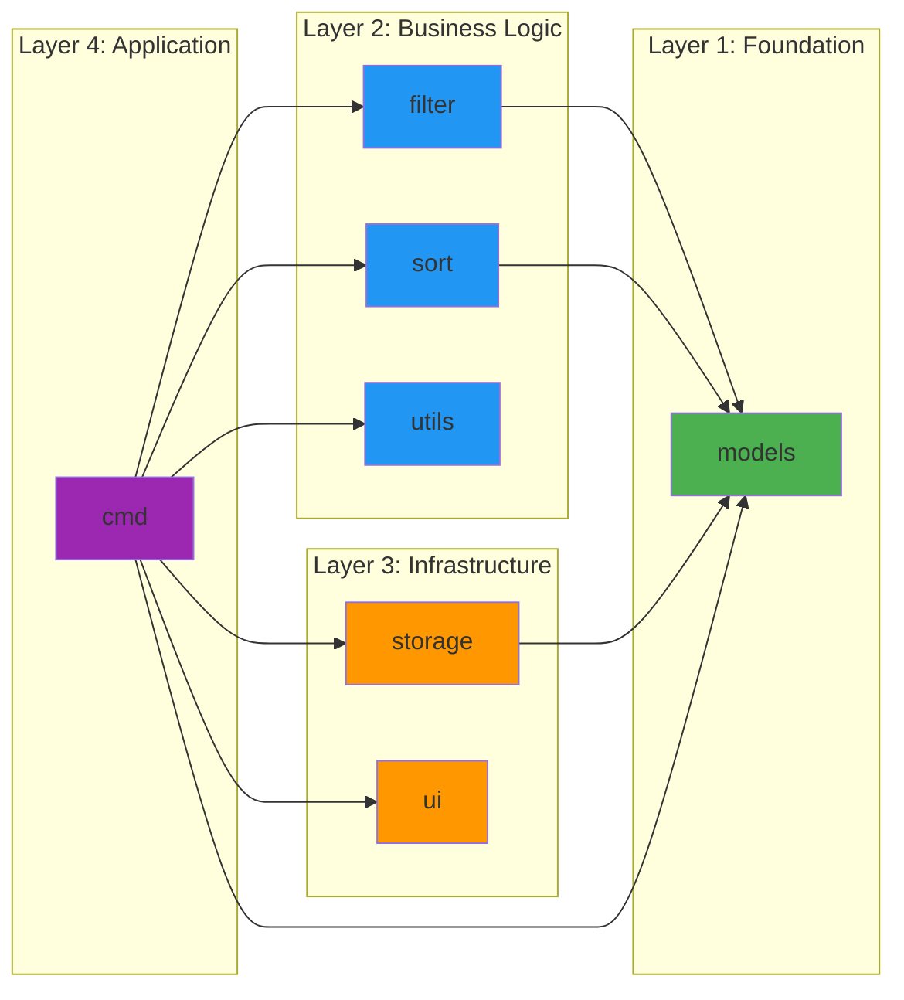

**Dependency Rules:**

1. **Layer 1 (Models)**: No dependencies on other layers
2. **Layer 2**: Can depend on Layer 1 only
3. **Layer 3**: Can depend on Layers 1 and 2
4. **Layer 4**: Can depend on all lower layers

---

## Design Patterns

### 1. Repository Pattern (Storage)

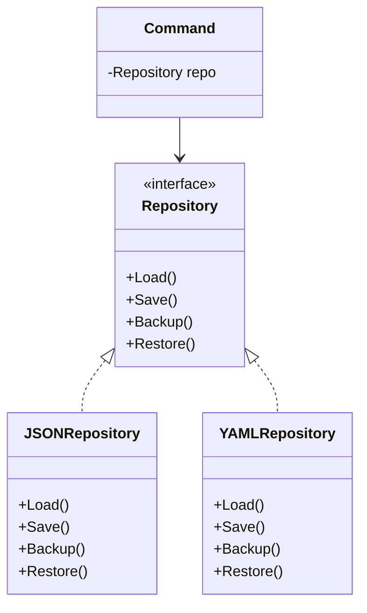

**Benefits:**

- Abstracts data access
- Easy to swap implementations
- Testable with mocks

### 2. Strategy Pattern (Filtering & Sorting)

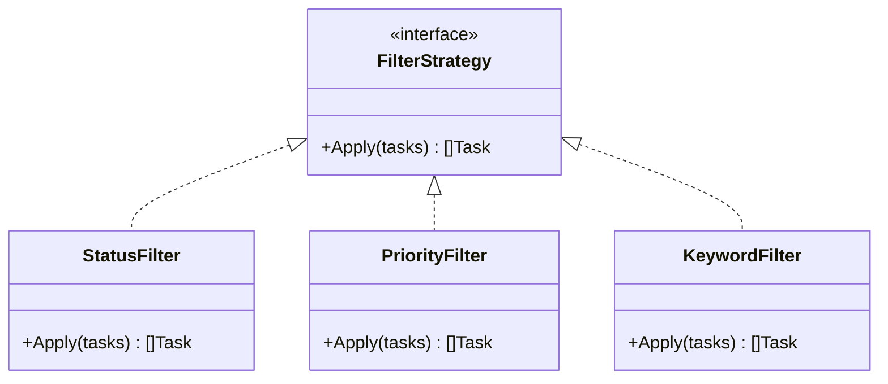

**Benefits:**

- Flexible filtering logic
- Composable filters
- Easy to add new filter types

### 3. Command Pattern (CLI Commands)

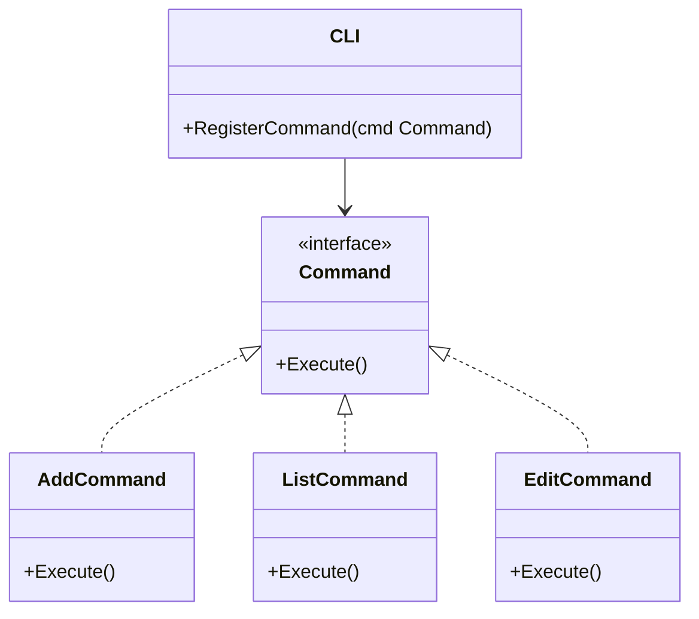

**Benefits:**

- Encapsulates actions
- Easy to add new commands
- Supports undo/redo (future enhancement)

### 4. Factory Pattern (Filter & Storage Creation)

```go
// Filter Factory
func NewStatusFilter(status Status) *Filter
func NewPriorityFilter(priority Priority) *Filter
func NewKeywordFilter(keyword string) *Filter

// Storage Factory
func NewJSONStorage() (*JSONStorage, error)
func NewYAMLStorage() (*YAMLStorage, error)
```

---

## Technology Stack

### Core Technologies

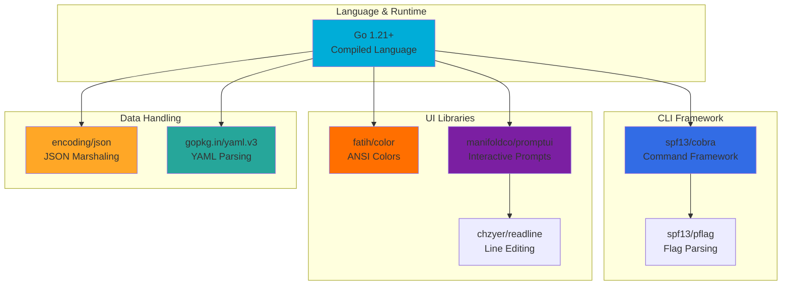

### Library Selection Rationale

| Library         | Purpose             | Why Chosen                                           |
| --------------- | ------------------- | ---------------------------------------------------- |
| **Cobra**       | CLI framework       | Industry standard, used by kubectl, Hugo, GitHub CLI |
| **promptui**    | Interactive prompts | Rich terminal UI, arrow key navigation               |
| **fatih/color** | Terminal colors     | Cross-platform, easy API, widely used                |
| **yaml.v3**     | YAML parsing        | Latest version, full YAML 1.2 support                |

---

## Error Handling Architecture

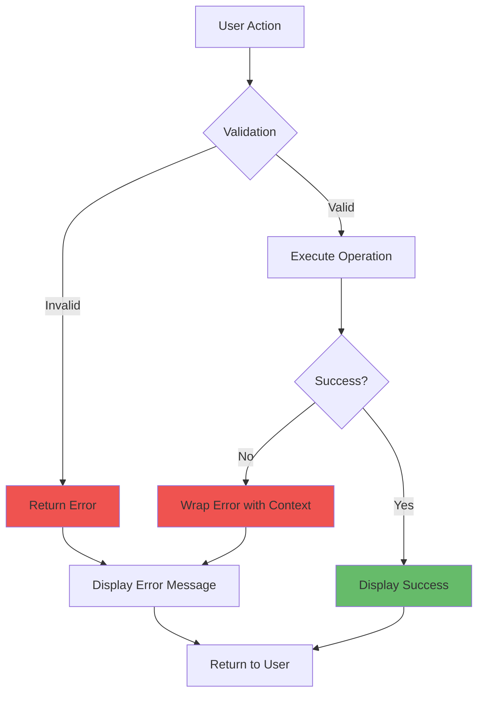

**Error Handling Principles:**

1. **Early Validation**: Check inputs before processing
2. **Error Wrapping**: Add context to errors as they bubble up
3. **User-Friendly Messages**: Translate technical errors to clear messages
4. **Graceful Degradation**: Continue operation where possible
5. **Logging**: Record errors for debugging (future enhancement)

---

## Scalability Considerations

### Current Scale

- **Target**: Individual users managing 100-10,000 tasks
- **Performance**: In-memory operations on entire task list
- **Storage**: Single JSON/YAML file

### Future Scaling Paths

```mermaid
graph LR
    A[Current<br/>File-based] --> B[SQLite<br/>Local DB]
    B --> C[PostgreSQL<br/>Shared DB]
    C --> D[Cloud Storage<br/>Multi-device]

    style A fill:#4caf50
    style B fill:#2196f3
    style C fill:#ff9800
    style D fill:#9c27b0
```

**Scaling Strategy:**

1. Add SQLite storage implementation (10K+ tasks)
2. Implement pagination for large lists
3. Add caching layer
4. Consider client-server architecture for collaboration

---

## Testing Strategy

```mermaid
graph TB
    subgraph "Unit Tests"
        UT1[Models Tests<br/>Task logic]
        UT2[Filter Tests<br/>Filter algorithms]
        UT3[Sort Tests<br/>Sort algorithms]
        UT4[Storage Tests<br/>Mocked I/O]
    end

    subgraph "Integration Tests"
        IT1[Command Tests<br/>End-to-end flows]
        IT2[Storage Tests<br/>Real file I/O]
    end

    subgraph "Manual Tests"
        MT1[Interactive Mode<br/>User experience]
        MT2[CLI Usage<br/>Real scenarios]
    end

    style UT1 fill:#81c784
    style UT2 fill:#81c784
    style UT3 fill:#81c784
    style UT4 fill:#81c784
    style IT1 fill:#64b5f6
    style IT2 fill:#64b5f6
    style MT1 fill:#ffb74d
    style MT2 fill:#ffb74d
```

---

## Security Considerations

### Current Security Measures

```mermaid
graph TD
    A[User Input] --> B[Input Validation]
    B --> C[Sanitization]
    C --> D[Processing]

    E[File Operations] --> F[Permission Checks]
    F --> G[Safe File Paths]
    G --> H[Write to Disk]

    I[Data Storage] --> J[Local Storage Only]
    J --> K[User Directory Permissions]

    style B fill:#66bb6a
    style C fill:#66bb6a
    style F fill:#66bb6a
    style G fill:#66bb6a
    style K fill:#66bb6a
```

**Security Principles:**

1. **Input Validation**: Sanitize all user inputs
2. **File Permissions**: Use appropriate file permissions (0644 for files, 0755 for directories)
3. **Path Safety**: Prevent path traversal attacks
4. **No Network**: No external communication (air-gapped by design)
5. **Local Only**: Data stays on user's machine

### Future Security Enhancements

- [ ] Encryption at rest for sensitive tasks
- [ ] Optional password protection
- [ ] Secure cloud sync with E2E encryption

---

## Performance Characteristics

### Time Complexity

| Operation    | Best Case  | Average Case | Worst Case |
| ------------ | ---------- | ------------ | ---------- |
| Add Task     | O(1)       | O(1)         | O(n)\*     |
| List Tasks   | O(n)       | O(n)         | O(n)       |
| Filter Tasks | O(n)       | O(n)         | O(n)       |
| Sort Tasks   | O(n log n) | O(n log n)   | O(n log n) |
| Search Tasks | O(n)       | O(n)         | O(n)       |
| Edit Task    | O(n)       | O(n)         | O(n)       |
| Delete Task  | O(n)       | O(n)         | O(n)       |
| Save to Disk | O(n)       | O(n)         | O(n)       |

\*O(n) when saving to disk

### Space Complexity

- **Memory**: O(n) where n = number of tasks
- **Disk**: O(n) for main file + O(m) for m backups

### Performance Optimizations

- **In-memory operations**: All filtering/sorting done in RAM
- **Lazy loading**: Load data only when needed
- **Efficient sorting**: Uses Go's optimized sort.Slice
- **Minimal allocations**: Reuse structures where possible

---

## Extension Points

The architecture provides clear extension points for future enhancements:

```mermaid
graph TB
    subgraph "Current Features"
        A[Task Management]
        B[Filtering]
        C[Sorting]
        D[Storage]
    end

    subgraph "Easy Extensions"
        E[New Storage Backend<br/>Implement Storage interface]
        F[New Filter Type<br/>Add to Filter struct]
        G[New Sort Criteria<br/>Add to SortBy enum]
        H[New Command<br/>Add cmd/*.go file]
    end

    subgraph "Future Features"
        I[Recurring Tasks<br/>Add RecurrenceRule to Task]
        J[Subtasks<br/>Add ParentID to Task]
        K[Collaboration<br/>Add User to Task]
        L[Sync Service<br/>New sync package]
    end

    A --> E
    B --> F
    C --> G
    D --> H

    E --> I
    F --> J
    G --> K
    H --> L

    style E fill:#81c784
    style F fill:#81c784
    style G fill:#81c784
    style H fill:#81c784
    style I fill:#64b5f6
    style J fill:#64b5f6
    style K fill:#64b5f6
    style L fill:#64b5f6
```

---

## Conclusion

The Todo CLI architecture is designed to be:

✅ **Maintainable**: Clear separation of concerns, well-documented
✅ **Extensible**: Easy to add new features and storage backends
✅ **Testable**: Interface-based design enables easy mocking
✅ **Performant**: Efficient algorithms and data structures
✅ **User-Friendly**: Intuitive CLI and interactive mode
✅ **Professional**: Follows Go best practices and industry standards

The architecture balances simplicity for current needs with flexibility for future growth, making it a solid foundation for a production-grade CLI application.
